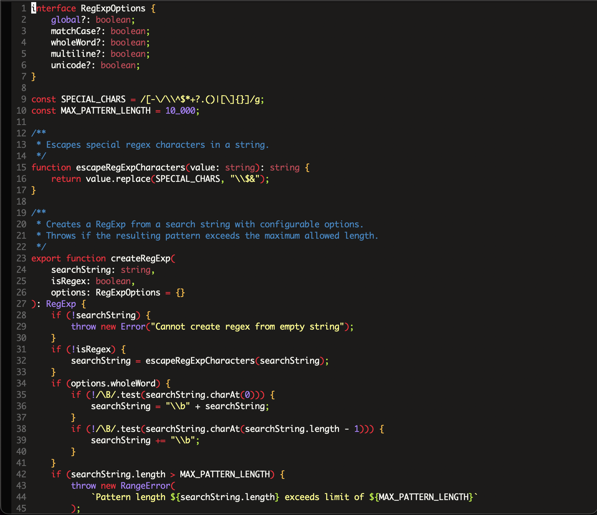
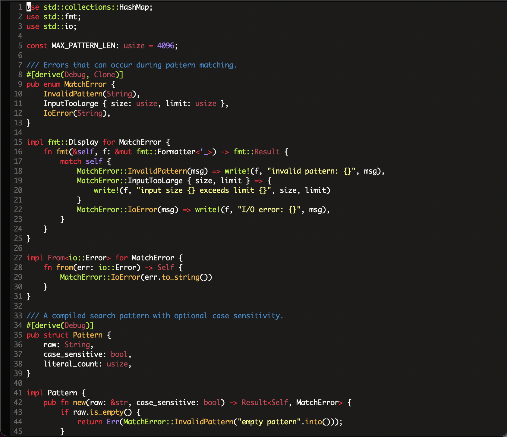
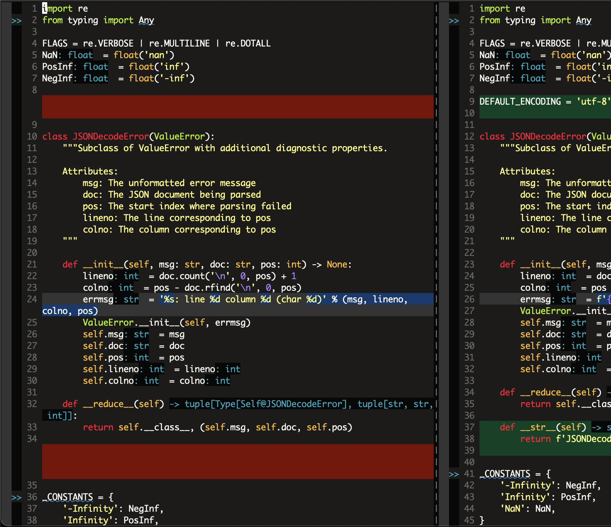

## harlequin ##

Dark, high contrast, warm colorscheme for gvim and 256 color terminal inspired by [molokai](https://github.com/tomasr/molokai) and [badwolf](https://github.com/sjl/badwolf).

You can also get it from vim.org [here](http://www.vim.org/scripts/script.php?script_id=4195).

### properties ###

- dark background, warm colors, high contrast, but nothing too garish
- everything that's constantly on screen and not code is low key
- no color clashes, where very different colors are close to each other

### contribute ###

Pull requests welcome. Please open issues if you find something that looks wonky.

### languages ###

Hand-optimized for: C, C++, Python, Ruby, JavaScript, TypeScript, Rust, Go, Java, Kotlin, Swift, VimScript, XML, HTML, CSS, SQL, Bash, Markdown, JSON, and YAML.

### plugins ###

vim-easymotion, coc.nvim, vimdiff.

### screenshots ###

TypeScript

Rust

Diff mode

See the [full gallery](GALLERY.md) for all supported languages.
