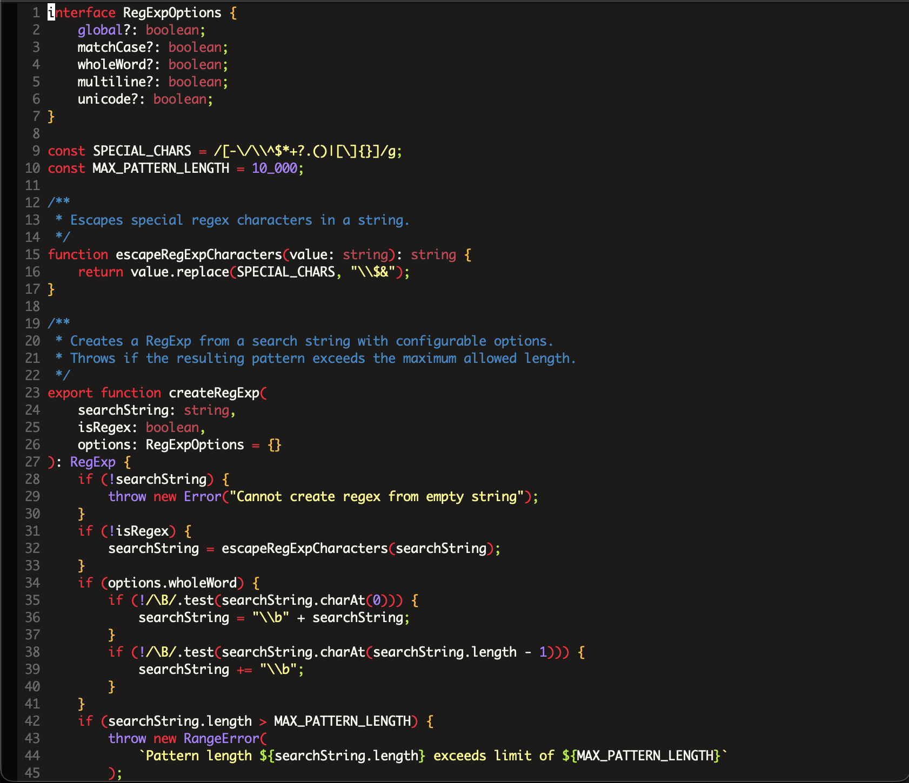
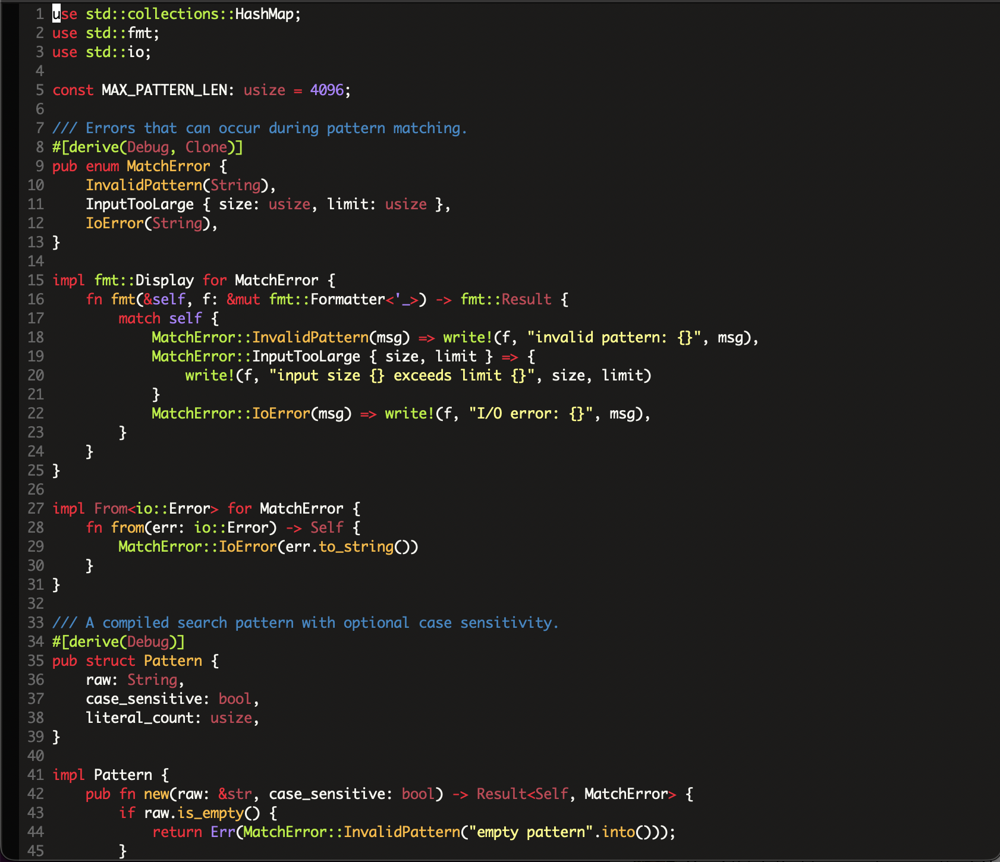
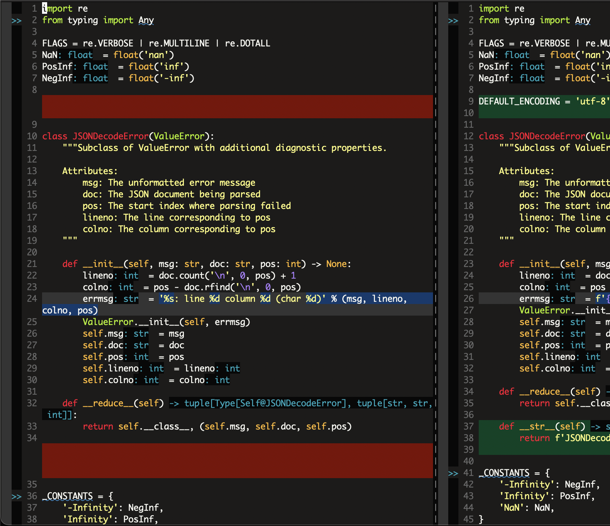

## harlequin ##

Dark, high contrast, warm colorscheme for gvim and 256 color terminal inspired by [molokai](https://github.com/tomasr/molokai) and [badwolf](https://github.com/sjl/badwolf).

You can also get it from vim.org [here](http://www.vim.org/scripts/script.php?script_id=4195).

### properties ###

- dark background, warm colors, high contrast, but nothing too garish
- everything that's constantly on screen and not code is low key
- no color clashes, where very different colors are close to each other

### contribute ###

Pull requests welcome. Please open issues if you find something that looks wonky.

### releases ###

Run `just release` with Python 3.9+ and Git from a clean, current `master` checkout with complete
history and matching local/origin version tags. It proposes a two-part `MAJOR.MINOR` version,
runs the release-tool tests, and prompts. Enter `y` to publish, a version or `minor`/`major` to
revise the proposal, or press Enter to cancel.

`just release major` and `just release 3.0` preselect an override through the same prompt.
`just release --dry-run` reads Git state and previews without checks or publication. `--yes`
explicitly confirms unattended use; other nonterminal invocations fail. Features and fixes
propose a minor bump, breaking changes a major bump, and maintenance-only changes require an
explicit version. There is no patch component.

Confirmation atomically pushes `master` and its annotated tag for Git consumers, including local
commits counted in the preview. No version-file commit is needed. A failed push leaves the local
tag for inspection; public tags must not be replaced. Uploading to vim.org is still manual.
`scripts/release.json` declares the release policy and checks.

### languages ###

Hand-optimized for: C, C++, Python, Ruby, JavaScript, TypeScript, Rust, Go, Java, Kotlin, Swift, VimScript, XML, HTML, CSS, SQL, Bash, Markdown, JSON, and YAML.

### plugins ###

vim-easymotion, coc.nvim, vimdiff.

### screenshots ###

TypeScript

Rust

Diff mode

See the [full gallery](GALLERY.md) for all supported languages.
